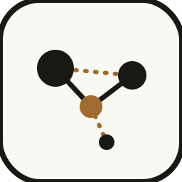
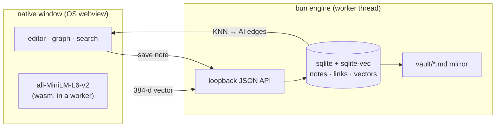

<div align="center">



# crossbean

**Notes that find each other.**

A local-first desktop notebook where your notes form a knowledge graph —
linked by hand with `[[wikilinks]]`, and by *meaning* with a vector database.

[](https://bun.sh)
[](https://github.com/asg017/sqlite-vec)
[](https://huggingface.co/Xenova/all-MiniLM-L6-v2)
[](LICENSE)


*100% local · no accounts · no API keys · your notes never leave your machine*

</div>

---

## Why

Obsidian's graph shows the links you *remembered* to make. crossbean also shows
the ones you didn't: every note is embedded into a vector space, and notes that
mean similar things connect automatically.

- 🖋 **Write markdown** in a split editor with live preview
- 🔗 **Link by hand** — `[[Note Title]]`, rendered as ink-blue edges
- 🧠 **Linked by meaning** — cosine-similar notes connect as AI edges, with a
  live threshold slider
- 🔍 **Semantic search** — find notes by what they're about, not keywords
- 🕸 **Force-directed graph** — drag, zoom, click through your vault
- 📁 **Plain-text vault** — every note mirrors to `vault/*.md`, openable anywhere
- 🎨 **Two personalities** — *paper & ink* (serif, warm, quiet) and
  *terminal* (mono, dark, dense), one click apart

## How it works



No Electron, no Node, no external services. One compiled binary, two native
libraries, and the webview your OS already ships. The embedding model
(~30 MB) downloads once on first launch and is cached offline after that.

## Install

Grab the latest from **[Releases](../../releases)**:

| Platform | Artifact |
|---|---|
| **Windows** | `crossbean-setup-windows-x64.exe` (installer) or the portable `.zip` |
| **Debian / Ubuntu** | `crossbean_<version>_amd64.deb` → `sudo apt install ./crossbean_*.deb` |
| **Fedora / RHEL** | `crossbean-<version>.x86_64.rpm` → `sudo dnf install ./crossbean-*.rpm` |
| **macOS** | `crossbean-macos-arm64.dmg` (Apple Silicon) |

Linux needs WebKitGTK (`libwebkit2gtk-4.1`) — the packages declare it as a
dependency. Your data lives in the OS data dir (`%APPDATA%\crossbean`,
`~/.local/share/crossbean`, `~/Library/Application Support/crossbean`).

> **macOS first launch:** the app isn't code-signed (yet), so Gatekeeper will
> warn you. **Right-click the app → Open → Open** — once, then it opens
> normally forever. If it says *"damaged"*, run
> `xattr -cr /Applications/crossbean.app` in Terminal and open it again.

## Web version (multi-user, shared vaults)

crossbean also runs in the browser with accounts and shared vaults, backed by
your own free [Supabase](https://supabase.com) project — auth, Postgres +
pgvector, and row-level security. Same UI, same in-browser embeddings.
Setup guide: **[web/README.md](web/README.md)**.

## Run from source

```sh
# requires bun — https://bun.sh
git clone <this repo> && cd crossbean
bun install
bun run start        # opens the app window
bun run seed         # optional: demo notes so the graph has clusters
```

## Use it

| Action | How |
|---|---|
| New note | **+ New note**, write markdown |
| Link notes | type `[[Some Note Title]]` |
| See the graph | **Graph** tab — drag nodes, scroll to zoom, click to open |
| Tune AI edges | the similarity slider (default 0.30) |
| Search by meaning | sidebar search box, <kbd>Enter</kbd> |
| Related notes | chips under the editor, ranked by similarity |
| Switch theme | `> terminal` / `¶ paper` button, top right |
| Group notes | the 🗂 picker above the editor — folders in the sidebar |
| Add images | paste, drag-drop, or the 🖼 button |
| Delete note | hover a note in the sidebar → ✕ (or <kbd>Ctrl</kbd>+<kbd>Shift</kbd>+<kbd>Backspace</kbd>) |

## Development

```sh
bun run dev            # watch mode
bun run test           # headless end-to-end tests (isolated data dir)
bun run build:release  # compiled binary + assets → dist/
```

- **[DESIGN.md](DESIGN.md)** — architecture, data model, and the reasoning
- **[AGENTS.md](AGENTS.md)** — working agreements for AI agents (and humans)
- **[packaging/](packaging/)** — installer builds; releases ship from CI on `v*` tags

## Stack

| Concern | Choice |
|---|---|
| Runtime | [Bun](https://bun.sh) |
| Window | [webview-bun](https://github.com/tr1ckydev/webview-bun) → WebView2 / WebKitGTK / WKWebView |
| Vector DB | [sqlite-vec](https://github.com/asg017/sqlite-vec) inside `bun:sqlite` |
| Embeddings | [Transformers.js](https://huggingface.co/docs/transformers.js) · `Xenova/all-MiniLM-L6-v2` |
| Markdown | [marked](https://marked.js.org) |
| Graph | hand-rolled force simulation on `<canvas>` (~200 lines, zero deps) |

## License

[MIT](LICENSE)
